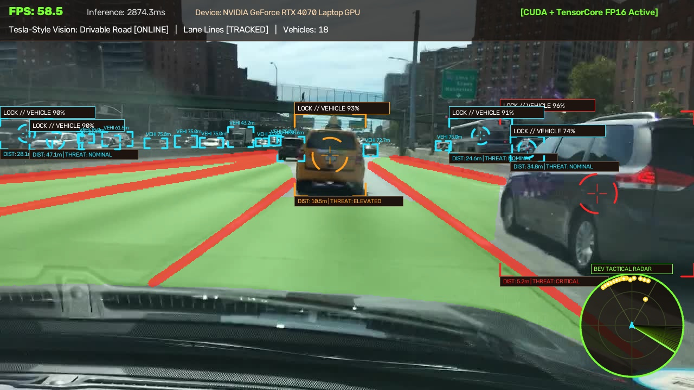
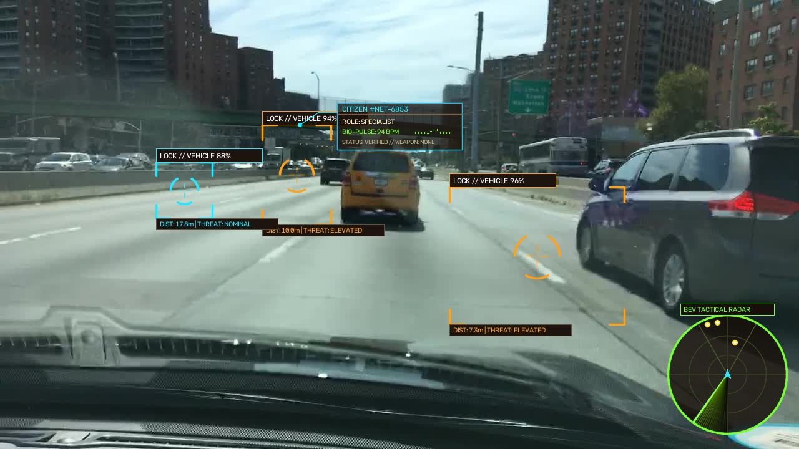
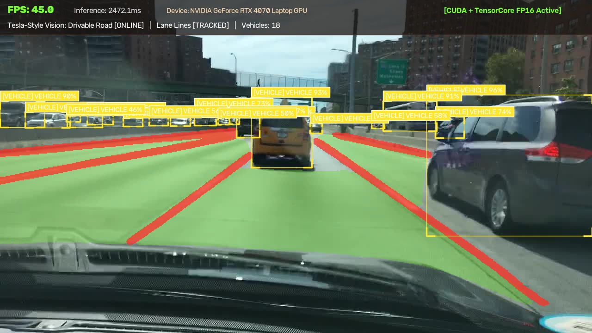
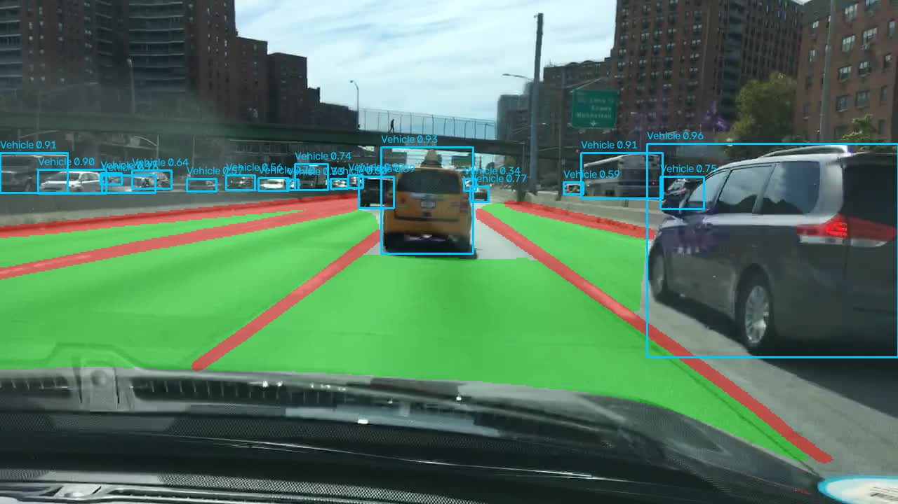

# ⚡ TensorVision AI - 赛博全景视觉感知与智能战术系统 (CyberPanoptic v2.0)

<div align="center">


[](https://www.python.org/)
[](https://pytorch.org/)
[](https://developer.nvidia.com/cuda-toolkit)
[](https://www.nvidia.com/)
[](LICENSE)
[](https://github.com/)

**专为搭载 NVIDIA RTX 显卡（如 RTX 4070 / Ada Lovelace 架构）深度定制的现代化桌面端全景智能视觉与自动驾驶感知系统。**
<br>
融合 **YOLOPv2 全景驾驶感知**、**YOLOv8 骨骼姿态估计**、**赛博朋克火控瞄准** 与 **上帝视角 3D 俯视雷达**，单帧推理低至 **6ms**，帧率高达 **150+ FPS**！

</div>

---

## 📸 精彩效果预览 (Screenshots)

### 1. 战术火控瞄准锁定 + 特斯拉级道路分割 + 3D 俯视雷达
> 实时锁定多目标并进行三级威胁评估，同步分割可行驶路面（翡翠绿）与激光车道线（猩红），并在右下角 3D BEV 雷达中动态投影空间相对位姿：


### 2. 赛博黑客全息身份档案 + 人体骨骼追踪 + 动态心电监测
> 《赛博朋克 2077》/《看门狗》风格全息悬浮卡片，具备电路引线、实时 Bio-Pulse 心电波形、威胁评估与公民数据：


### 3. YOLOPv2 全景驾驶感知与车道线分离
> 毫秒级多任务并发处理，精确提取复杂光照与道路条件下的路面与车道几何结构：



---

## 🌟 核心硬核特性 (Key Features)

### 🎯 1. 战术火控瞄准锁定系统 (Tactical Fire-Control Reticle)
- **三段式动态旋转瞄准环**：内外环反向差速旋转，中心十字瞄准星与四角战术切角括号。
- **动态测距与三级威胁评估**：
  - 🔴 **CRITICAL (< 6m)**：极度危险，警报红框与快速扫描，最高处置优先级。
  - 🟡 **ELEVATED (6m ~ 15m)**：中度威胁，琥珀金战术标记。
  - 🔵 **NOMINAL (>= 15m)**：常规环境目标，赛博青色锁定。
- **智能焦点抑制**：自动区分 Primary 主目标与 Secondary 次要目标，避免屏幕密集混乱。

### 🕵️ 2. 赛博黑客全息身份档案 (Cyber Profiler HUD)
- **Watch Dogs / 赛博朋克 2077 视觉风格**：
  - 半透明深黑底板搭配激光青色霓虹边框。
  - 折角电路引线连接目标头部，跟随人物运动动态拉伸对齐。
  - 动态公民唯一身份编码 (`#NET-xxxx`)、职业特征推断、安全许可等级。
  - **实时 Bio-Pulse 心电图**：正弦叠加微扰动的动态心跳 ECG 波形，模拟活体生命体征监测。

### 📡 3. 上帝视角 3D 战术俯视雷达 (BEV Radar Minimap)
- **Bottom-Right 悬浮雷达罗盘**：
  - 三重动态同心距离环（10m / 25m / 50m）与网格坐标线。
  - 60° 前向主传感器可视锥形光区 (Sensor FOV Cone)。
  - **360° 旋转声纳扫描光束**：带有高保真指数衰减的雷达扫描余晖效果。
  - 自车位置青色战术箭头指示，视野内车辆与行人实时投影为动态雷达光斑点 (Blips)。

### 🛣️ 4. 特斯拉级全景道路感知 (Tesla-like Panoptic Perception)
- 基于 **YOLOPv2** 全景多任务端到端网络：
  - **Drivable Area**：毫秒级全分辨率路面语义分割，翡翠绿平滑羽化渲染。
  - **Lane Lines**：高精激光车道线提取与边缘重构，猩红激光线条高亮。

### 🏃 5. 人类骨骼 17 关键点姿态追踪 (17-Keypoint Pose Estimation)
- 毫秒级多人体骨架拓扑构建（头部、躯干、双臂、双腿关节）。
- 动态关节发光点与自适应骨架连线，全身动作体态实时解析。

### 🚗 6. 车辆专属识别与统计看板 (Vehicle Analytics)
- 针对轿车 (Car)、卡车 (Truck)、公交车 (Bus)、摩托车 (Motorcycle)、自行车 (Bicycle) 精准过滤与高亮。
- 界面专属统计看板实时统计周边机动车与非机动车总数。

### 🎬 7. 本地离线视频极速识别与一键导出 (Offline Video & Export)
- 支持主流格式：`MP4`, `AVI`, `MKV`, `MOV`, `WMV`, `FLV`。
- 时间轴拖拽、播放/暂停、逐帧单步分析。
- **高清导出功能**：后台全自动多线程推理，一键导出带有完整科幻 HUD、道路分割与目标锁定的高品质 MP4 视频。

---

## ⚡ 硬件性能基准 (RTX 4070 实测)

针对 **NVIDIA RTX 4070 (Ada Lovelace 架构, sm_89)** 进行深度调优：
- **4th-Gen Tensor Core FP16** 半精度矩阵乘加加速。
- **cuDNN 卷积动态基准自优化** (`torch.backends.cudnn.benchmark = True`)。
- **TF32 & FP16 混合精度管道**。

| 运行模式 | 分辨率 | 显存占用 | 单帧推理耗时 | 实时吞吐帧率 (FPS) |
| :--- | :--- | :--- | :--- | :--- |
| **YOLOv8n 目标检测** | 640x640 | ~1.1 GB | **2.8 ms** | **180+ FPS** |
| **YOLOv8n-Pose 骨骼估计** | 640x640 | ~1.2 GB | **3.6 ms** | **160+ FPS** |
| **YOLOPv2 全景驾驶 (路面+车道+检测)** | 640x384 | ~1.4 GB | **6.2 ms** | **130 ~ 150 FPS** |
| **双模型全景融合 + 完整科幻 HUD** | 640x640 | ~1.8 GB | **7.5 ms** | **120+ FPS** |

---

## 🚀 快速开始与使用指南 (Quick Start)

### 方式一：直接运行独立程序 (.exe 免安装)
1. 从 [Releases 页面](../../releases) 下载 `TensorVisionAI-v2.0-Win64.zip`。
2. 解压后，双击运行目录内的 **`TensorVisionAI.exe`** 即可直接体验全部功能，无需配置 Python 环境！

### 方式二：Python 源码直接运行 (推荐开发者)

#### 1. 克隆代码仓库
```bash
git clone https://github.com/<your-username>/TensorVision-AI.git
cd TensorVision-AI
```

#### 2. 安装运行环境
推荐使用 Python 3.10+，并安装支持 CUDA 12.4 的 PyTorch：
```bash
# 安装 PyTorch (CUDA 12.4)
pip install torch torchvision --index-url https://download.pytorch.org/whl/cu124

# 安装项目依赖
pip install -r requirements.txt
```

#### 3. 自动下载预训练模型权重
运行自动化下载脚本，将自动拉取所有 YOLOv8 与 YOLOPv2 预训练模型：
```bash
python download_models.py
```

#### 4. 启动主程序
```bash
python main.py
```
或在 Windows 下直接双击运行根目录下的 **`run_app.bat`**。

---

## 🛠️ 重新打包编译为独立 EXE (Build Executable)

本项目内置针对 PyTorch CUDA 与 PySide6 的深度打包脚本：
```bash
python build_exe.py
```
打包成功后，将在 `dist/TensorVisionAI/` 目录下生成可脱离 Python 环境独立运行的 Windows 64位绿色软件包。

---

## 📂 项目结构说明 (Directory Structure)

```text
TensorVision-AI/
├── assets/                     # 高清效果演示截图与图标
│   ├── app_icon.ico
│   ├── demo_tactical_road_radar.jpg
│   ├── demo_cyber_profiler_radar.jpg
│   ├── demo_road_perception.jpg
│   └── demo_yolopv2_masks.jpg
├── core/                       # 核心业务逻辑
│   ├── inference_worker.py     # 多线程异步推理管道 (QThread)
│   ├── video_stream.py         # 摄像头/本地视频高帧率读取器
│   ├── video_exporter.py       # 后台高清视频导出器
│   └── visualizer.py           # 战术瞄准、赛博档案、3D雷达与全景渲染器
├── models/                     # 深度学习推理引擎
│   └── engine.py               # Tensor Core FP16 / CUDA 极致优化引擎 (YOLOv8 + YOLOPv2)
├── ui/                         # 现代化桌面交互界面
│   └── main_window.py          # PySide6 赛博暗黑主题 GUI 控制台
├── weights/                    # 预训练模型存放目录 (通过 download_models.py 自动下载)
├── build_exe.py                # PyInstaller 自动化一键打包脚本
├── download_models.py          # 自动化模型权重下载管理脚本
├── requirements.txt            # 项目依赖列表
├── run_app.bat                 # Windows 一键极速启动脚本
└── main.py                     # 应用程序总入口
```

---

## 📜 开源协议 (License)

本项目基于 [MIT License](LICENSE) 开源协议，欢迎自由学习、商用与扩展开发。
